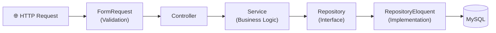

<h1 align="center">
  🏭 Inventory Management System (Controle de Estoque)
</h1>

<p align="center">
  <em>Read in other languages:</em><br>
  🇧🇷 <a href="README.md">Português</a> &nbsp;&middot;&nbsp; 🇺🇸 <strong>English</strong> &nbsp;&middot;&nbsp; 🇪🇸 <a href="README.es.md">Español</a>
</p>

<p align="center">
  Modular system for inventory, purchasing, finance, and sales management,<br>
  built with <strong>Laravel 10 · Vue.js · Inertia.js · Docker</strong>
</p>

<p align="center">
  
  
  
  
  
  
  
  
</p>

<p align="center">
  <a href="#-about-the-project">About</a> •
  <a href="#-features">Features</a> •
  <a href="#-tech-stack">Tech Stack</a> •
  <a href="#-architecture">Architecture</a> •
  <a href="#-getting-started">Getting Started</a> •
  <a href="#-testing">Testing</a>
</p>

---

## 📌 About the Project

The **Inventory Management System** is a complete web application designed for small and medium-sized businesses that need to centralize the management of **inventory, purchasing, suppliers, finance, and sales** in one place.

The system offers **smart visual alerts**: products below the minimum stock quantity are highlighted in **purple**, expired products turn **red**, and products nearing expiration (less than 7 days) turn **yellow** — ensuring the manager never loses track.

The project is developed with a focus on **clean architecture**, utilizing the **Feature Modules pattern**, **Repository Pattern**, **Service Layer**, and **FormRequests** for a clear separation of concerns.

---

## ✅ Features

### 📦 Stock Module
- Registration and control of products in stock
- Automatic visual alerts: expiration (🔴 expired / 🟡 within 7 days / 🟣 below minimum)
- Advanced filtering system across all relevant fields
- Product exit history (visible only to administrators, via Laravel cache)

### 🛒 Purchases Module
- Complete workflow: Requisition → Quotation → Purchase Order → Receipt → Conference → Return → Accounts Payable
- Supplier and purchase order control

### 💰 Finance Module
- Cost Centers (with parent/child hierarchy)
- Accounting Accounts
- Expense control

### 🏷️ Products Module
- Registration of products, brands, and categories
- Units of measure and price tables control
- Activation/deactivation by the administrator

### 👥 Customers & Suppliers Module
- Comprehensive registration of customers and suppliers
- Name search across all listings

### ⚙️ Admin Module
- User management
- Role-based access control
- Record activation/deactivation (products, suppliers, brands)

### 🔧 Cross-cutting Features
- Authentication with **Laravel Jetstream + Sanctum**
- Export to **Excel** (maatwebsite/excel)
- **DataTables** with server-side pagination
- **Google API** integration (google/apiclient)
- Integrated **WhatsApp** bot
- Containerization with **Docker + docker-compose**

---

## 🛠️ Tech Stack

| Layer | Technologies |
|--------|------------|
| **Backend** | PHP 8.1 · Laravel 10 · Laravel Jetstream · Sanctum · Livewire 3 |
| **Frontend** | Vue.js 3 · Inertia.js · Vite · Tailwind CSS · Bootstrap 5 |
| **Database** | MySQL 8 (via Docker) |
| **Testing** | PHPUnit 10 · Feature Tests · Unit Tests |
| **Infra** | Docker · docker-compose · Nginx |
| **Tools** | Laravel DataTables · Maatwebsite Excel · Ziggy · L5-Repository |

---

## 🏗️ Architecture

The project follows a **Feature Modules** architecture, where each business domain is isolated in its own module along with all its artifacts.

```
Modules/
├── Admin/
├── Finance/        ← Cost Centers, Chart of Accounts, Expenses
├── Products/       ← Products, Brands, Categories
├── Purchases/      ← Complete purchasing flow
├── Sales/          ← Sales and price tables
├── Stock/          ← Inventory with visual alerts
├── Customers/
├── Suppliers/
└── ...
```

Each module adheres to the following pattern:

```
Modules/<Module>/
├── Http/
│   ├── Controllers/
│   └── Requests/         ← FormRequests (validation)
├── Services/             ← Business logic and orchestration
├── Repositories/
│   ├── Contracts/        ← Repository interfaces
│   └── Eloquent/         ← Eloquent implementations
├── Models/               ← Relationships, casts, and scopes
├── Database/
│   ├── Migrations/
│   ├── Seeders/
│   └── Factories/
├── Resources/
│   └── js/Pages/         ← Vue.js Pages (Inertia)
└── Routes/
```

### HTTP Request Data Flow



---

## 🚀 Getting Started

### Prerequisites
- [Docker Desktop](https://www.docker.com/products/docker-desktop/) installed
- [Git](https://git-scm.com/)

### Installation Steps

```bash
# 1. Clone the repository
git clone https://github.com/SEU_USUARIO/Controle_Estoque.git
cd Controle_Estoque

# 2. Spin up the containers
docker-compose up -d

# 3. Access the application container
docker exec -it controle_estoque_app bash

# 4. Inside the container:
cd /var/www/html

# 5. Install PHP dependencies
composer install

# 6. Configure the environment
cp .env.example .env
php artisan key:generate

# 7. Run migrations and seeders
php artisan migrate --seed

# 8. Install JS dependencies and compile assets
npm install
npm run build

# 9. Access the application at: http://localhost
```

> **Tip:** For development with hot-reload, use `npm run dev` instead of `npm run build`.

---

## 🧪 Testing

The project has a test suite built with **PHPUnit 10**, organized by module:

```bash
# Run all tests
php artisan test

# Run tests for a specific module
php artisan test --testsuite=Modules

# Run with code coverage
php artisan test --coverage
```

The tests cover:
- ✅ **Feature Tests** — Complete HTTP flows (routes, controllers, responses)
- ✅ **Unit Tests** — Isolated services and business rules

---

## 📄 Technical Documentation

| Document | Description |
|-----------|-----------|
| [Architecture](docs/ARCHITECTURE.en.md) | Architectural overview (Feature Modules) |
| [Modules](docs/MODULES.en.md) | Detailed description of each module |
| [Patterns](docs/PATTERNS.en.md) | Repository Pattern, Service Layer, FormRequests |
| [Contributing](CONTRIBUTING.en.md) | Guidelines for contributing |

---

## 👨‍💻 Author

Developed by **Alberto Gabriel**

[](https://www.linkedin.com/in/albertogabrieldev/)
[](https://github.com/SEU_USUARIO)

---

## 📝 License

This project is licensed under the MIT License. See the [LICENSE](LICENSE) file for details.
