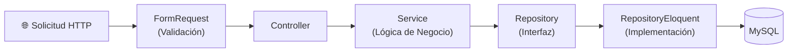

<h1 align="center">
  🏭 Software de Inventario (Controle de Estoque)
</h1>

<p align="center">
  <em>Leer en otros idiomas:</em><br>
  🇧🇷 <a href="./README.md">Português</a> &nbsp;&middot;&nbsp; 🇺🇸 <a href="./README.en.md">English</a> &nbsp;&middot;&nbsp; 🇪🇸 <strong>Español</strong>
</p>

<p align="center">
  Sistema modular para la gestión de inventario, compras, finanzas y ventas,<br>
  construido con <strong>Laravel 10 · Vue.js · Inertia.js · Docker</strong>
</p>

<p align="center">
  
  
  
  
  
  
  
  
</p>

<p align="center">
  <a href="#-acerca-del-proyecto">Acerca de</a> •
  <a href="#-características">Características</a> •
  <a href="#-tecnologías">Tecnologías</a> •
  <a href="#-arquitectura">Arquitectura</a> •
  <a href="#-cómo-ejecutar">Cómo Ejecutar</a> •
  <a href="#-pruebas">Pruebas</a>
</p>

---

## 📌 Acerca del Proyecto

El **Sistema de Control de Inventario** es una aplicación web completa diseñada para pequeñas y medianas empresas que necesitan centralizar la gestión de su **inventario, compras, proveedores, finanzas y ventas** en un solo lugar.

El sistema ofrece **alertas visuales inteligentes**: los productos por debajo de la cantidad mínima de stock resaltan en **morado**, los productos caducados se vuelven **rojos** y los productos próximos a caducar (en menos de 7 días) se vuelven **amarillos** — asegurando que el gerente nunca pierda el control.

El proyecto está desarrollado con un enfoque en la **arquitectura limpia**, utilizando el patrón de **Módulos por Funcionalidad (Feature Modules)**, el **Patrón Repositorio (Repository Pattern)**, la **Capa de Servicio (Service Layer)** y **FormRequests** para una clara separación de responsabilidades.

---

## ✅ Características

### 📦 Módulo de Inventario (Stock)
- Registro y control de productos en stock.
- Alertas visuales automáticas: caducidad (🔴 caducado / 🟡 a 7 días / 🟣 por debajo del mínimo).
- Sistema avanzado de filtros en todos los campos relevantes.
- Historial de salida de productos (visible solo para administradores, vía caché de Laravel).

### 🛒 Módulo de Compras (Purchases)
- Flujo de trabajo completo: Requisición → Cotización → Orden de Compra → Recepción → Conferencia → Devolución → Cuentas por Pagar.
- Control de proveedores y órdenes de compra.

### 💰 Módulo Financiero (Finance)
- Centros de Costos (con jerarquía padre/hijo).
- Cuentas Contables.
- Control de Gastos (Egresos).

### 🏷️ Módulo de Productos (Products)
- Registro de productos, marcas y categorías.
- Control de unidades de medida y tablas de precios.
- Activación/desactivación por el administrador.

### 👥 Módulo de Clientes y Proveedores (Customers & Suppliers)
- Registro completo de clientes y proveedores.
- Búsqueda por nombre en todas las listas.

### ⚙️ Módulo de Administración (Admin)
- Gestión de usuarios.
- Control de acceso por roles.
- Activación/desactivación de registros (productos, proveedores, marcas).

### 🔧 Características Transversales
- Autenticación con **Laravel Jetstream + Sanctum**.
- Exportación a **Excel** (maatwebsite/excel).
- **DataTables** con paginación desde el servidor (server-side).
- Integración con la **API de Google** (google/apiclient).
- Bot de **WhatsApp** integrado.
- Contenedores con **Docker + docker-compose**.

---

## 🛠️ Tecnologías

| Capa | Tecnologías |
|--------|------------|
| **Backend** | PHP 8.1 · Laravel 10 · Laravel Jetstream · Sanctum · Livewire 3 |
| **Frontend** | Vue.js 3 · Inertia.js · Vite · Tailwind CSS · Bootstrap 5 |
| **Base de Datos** | MySQL 8 (vía Docker) |
| **Pruebas** | PHPUnit 10 · Pruebas de Características (Feature Tests) · Pruebas Unitarias |
| **Infraestructura**| Docker · docker-compose · Nginx |
| **Herramientas** | Laravel DataTables · Maatwebsite Excel · Ziggy · L5-Repository |

---

## 🏗️ Arquitectura

El proyecto sigue una arquitectura de **Módulos por Funcionalidad (Feature Modules)**, donde cada dominio de negocio está aislado en su propio módulo junto con todos sus artefactos.

```
Modules/
├── Admin/
├── Finance/        ← Centros de Costos, Cuentas Contables, Egresos
├── Products/       ← Productos, Marcas, Categorías
├── Purchases/      ← Flujo completo de compras
├── Sales/          ← Ventas y tablas de precios
├── Stock/          ← Inventario con alertas visuales
├── Customers/
├── Suppliers/
└── ...
```

Cada módulo se adhiere al siguiente patrón:

```
Modules/<Módulo>/
├── Http/
│   ├── Controllers/
│   └── Requests/         ← FormRequests (validación)
├── Services/             ← Lógica de negocio y orquestación
├── Repositories/
│   ├── Contracts/        ← Interfaces del repositorio
│   └── Eloquent/         ← Implementaciones de Eloquent
├── Models/               ← Relaciones, casts y scopes
├── Database/
│   ├── Migrations/
│   ├── Seeders/
│   └── Factories/
├── Resources/
│   └── js/Pages/         ← Páginas de Vue.js (Inertia)
└── Routes/
```

### Flujo de Datos de Solicitud HTTP (Data Flow)



---

## 🚀 Cómo Ejecutar Localmente

### Requisitos Previos
- [Docker Desktop](https://www.docker.com/products/docker-desktop/) instalado.
- [Git](https://git-scm.com/).

### Pasos de Instalación

```bash
# 1. Clonar el repositorio
git clone https://github.com/SEU_USUARIO/Controle_Estoque.git
cd Controle_Estoque

# 2. Levantar los contenedores
docker-compose up -d

# 3. Acceder al contenedor de la aplicación
docker exec -it controle_estoque_app bash

# 4. Dentro del contenedor:
cd /var/www/html

# 5. Instalar dependencias de PHP
composer install

# 6. Configurar el entorno
cp .env.example .env
php artisan key:generate

# 7. Ejecutar migraciones y seeders
php artisan migrate --seed

# 8. Instalar dependencias JS y compilar assets
npm install
npm run build

# 9. Acceder a la aplicación en: http://localhost
```

> **Consejo:** Para desarrollo con recarga en vivo (hot-reload), use `npm run dev` en lugar de `npm run build`.

---

## 🧪 Pruebas

El proyecto tiene una suite de pruebas construida con **PHPUnit 10**, organizada por módulo:

```bash
# Ejecutar todas las pruebas
php artisan test

# Ejecutar pruebas para un módulo específico
php artisan test --testsuite=Modules

# Ejecutar con cobertura de código
php artisan test --coverage
```

Las pruebas cubren:
- ✅ **Pruebas de Características (Feature Tests)** — Flujos HTTP completos (rutas, controladores, respuestas).
- ✅ **Pruebas Unitarias (Unit Tests)** — Servicios aislados y reglas de negocio.

---

## 📄 Documentación Técnica

| Documento | Descripción |
|-----------|-----------|
| [Arquitectura](docs/ARCHITECTURE.es.md) | Visión general de la arquitectura (Facture Modules) |
| [Módulos](docs/MODULES.es.md) | Descripción detallada de cada módulo |
| [Patrones](docs/PATTERNS.es.md) | Padrón Repositorio, Capa de Servicio, FormRequests |
| [Contribución](CONTRIBUTING.es.md) | Guía para contribuyentes |

---

## 👨‍💻 Autor

Desarrollado por **Alberto Gabriel**

[](https://www.linkedin.com/in/albertogabrieldev/)
[](https://github.com/SEU_USUARIO)

---

## 📝 Licencia

Este proyecto está bajo la Licencia MIT. Consulta el archivo [LICENSE](LICENSE) para más detalles.
