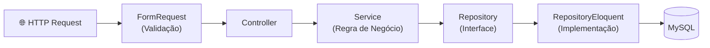

<h1 align="center">
  🏭 Controle de Estoque
</h1>

<p align="center">
  <em>Ler em outros idiomas:</em><br>
  🇧🇷 <strong>Português</strong> &nbsp;&middot;&nbsp; 🇺🇸 <a href="./README.en.md">English</a> &nbsp;&middot;&nbsp; 🇪🇸 <a href="./README.es.md">Español</a>
</p>

<p align="center">
  Sistema modular de gestão de estoque, compras, finanças e vendas,<br>
  construído com <strong>Laravel 10 · Vue.js · Inertia.js · Docker</strong>
</p>

<p align="center">
  
  
  
  
  
  
  
  
</p>

<p align="center">
  <a href="#-sobre-o-projeto">Sobre</a> •
  <a href="#-funcionalidades">Funcionalidades</a> •
  <a href="#-stack-técnica">Stack</a> •
  <a href="#-arquitetura">Arquitetura</a> •
  <a href="#-como-rodar">Como Rodar</a> •
  <a href="#-testes">Testes</a>
</p>

---

## 📌 Sobre o Projeto

O **Controle de Estoque** é um sistema web completo voltado para pequenas e médias empresas que precisam centralizar a gestão de **estoque, compras, fornecedores, finanças e vendas** em um único lugar.

O sistema oferece **alertas visuais inteligentes**: produtos abaixo da quantidade mínima ficam destacados em **roxo**, produtos vencidos ficam em **vermelho** e produtos próximos do vencimento (menos de 7 dias) ficam em **amarelo** — garantindo que o gestor jamais perca o controle.

O projeto é desenvolvido com foco em **arquitetura limpa**, utilizando **padrão de módulos por feature**, **Repository Pattern**, **Service Layer** e **FormRequests** para separação clara de responsabilidades.

---

## ✅ Funcionalidades

### 📦 Módulo de Estoque
- Cadastro e controle de produtos no estoque
- Alertas visuais automáticos: vencimento (🔴 vencido / 🟡 a 7 dias / 🟣 abaixo do mínimo)
- Sistema de filtros avançados por todos os campos relevantes
- Histórico de saída de produtos (visível apenas para administradores, via cache Laravel)

### 🛒 Módulo de Compras
- Fluxo completo: Requisição → Cotação → Pedido → Recebimento → Conferência → Devolução → Contas a Pagar
- Controle de fornecedores e pedidos de compra

### 💰 Módulo Financeiro
- Centros de Custo (com hierarquia pai/filho)
- Contas Contábeis
- Controle de Despesas

### 🏷️ Módulo de Produtos
- Cadastro de produtos, marcas e categorias
- Controle de unidades de medida e tabelas de preço
- Ativação/inativação pelo administrador

### 👥 Módulo de Clientes & Fornecedores
- Cadastro completo de clientes e fornecedores
- Pesquisa por nome em todas as listagens

### ⚙️ Módulo Admin
- Gerenciamento de usuários
- Controle de acesso por perfil
- Ativação/inativação de registros (produtos, fornecedores, marcas)

### 🔧 Funcionalidades Transversais
- Autenticação com **Laravel Jetstream + Sanctum**
- Export para **Excel** (maatwebsite/excel)
- **DataTables** com paginação server-side
- Integração com **API Google** (google/apiclient)
- Bot **WhatsApp** integrado
- Containerização com **Docker + docker-compose**

---

## 🛠️ Stack Técnica

| Camada | Tecnologias |
|--------|------------|
| **Backend** | PHP 8.1 · Laravel 10 · Laravel Jetstream · Sanctum · Livewire 3 |
| **Frontend** | Vue.js 3 · Inertia.js · Vite · Tailwind CSS · Bootstrap 5 |
| **Banco de Dados** | MySQL 8 (via Docker) |
| **Testes** | PHPUnit 10 · Feature Tests · Unit Tests |
| **Infra** | Docker · docker-compose · Nginx |
| **Ferramentas** | Laravel DataTables · Maatwebsite Excel · Ziggy · L5-Repository |

---

## 🏗️ Arquitetura

O projeto segue uma **arquitetura modular por feature** (Feature Modules), onde cada domínio de negócio é isolado em seu próprio módulo com todos os seus artefatos.

```
Modules/
├── Admin/
├── Finance/        ← Centros de Custo, Contas Contábeis, Despesas
├── Products/       ← Produtos, Marcas, Categorias
├── Purchases/      ← Fluxo completo de compras
├── Sales/          ← Vendas e tabelas de preço
├── Stock/          ← Estoque com alertas visuais
├── Customers/
├── Suppliers/
└── ...
```

Cada módulo segue o padrão abaixo:

```
Modules/<Modulo>/
├── Http/
│   ├── Controllers/
│   └── Requests/         ← FormRequests (validação)
├── Services/             ← Regras de negócio e orquestração
├── Repositories/
│   ├── Contracts/        ← Interface do repositório
│   └── Eloquent/         ← Implementação Eloquent
├── Models/               ← Relações, casts e scopes
├── Database/
│   ├── Migrations/
│   ├── Seeders/
│   └── Factories/
├── Resources/
│   └── js/Pages/         ← Páginas Vue.js (Inertia)
└── Routes/
```

### Fluxo de uma requisição HTTP



---

## 🚀 Como Rodar Localmente

### Pré-requisitos
- [Docker Desktop](https://www.docker.com/products/docker-desktop/) instalado
- [Git](https://git-scm.com/)

### Passo a passo

```bash
# 1. Clone o repositório
git clone https://github.com/SEU_USUARIO/Controle_Estoque.git
cd Controle_Estoque

# 2. Suba os containers
docker-compose up -d

# 3. Acesse o container da aplicação
docker exec -it controle_estoque_app bash

# 4. Dentro do container:
cd /var/www/html

# 5. Instale as dependências PHP
composer install

# 6. Configure o ambiente
cp .env.example .env
php artisan key:generate

# 7. Rode as migrations e seeders
php artisan migrate --seed

# 8. Instale as dependências JS e compile os assets
npm install
npm run build

# 9. Acesse em: http://localhost
```

> **Dica:** Para desenvolvimento com hot-reload, use `npm run dev` no lugar do `npm run build`.

---

## 🧪 Testes

O projeto possui suíte de testes com **PHPUnit 10**, organizados por módulo:

```bash
# Rodar todos os testes
php artisan test

# Rodar testes de um módulo específico
php artisan test --testsuite=Modules

# Rodar com cobertura de código
php artisan test --coverage
```

Os testes cobrem:
- ✅ **Feature Tests** — Fluxos HTTP completos (rotas, controllers, respostas)
- ✅ **Unit Tests** — Services e regras de negócio isoladas

---

## 📁 Estrutura do Repositório

```
Controle_Estoque/
├── src/                  ← Aplicação Laravel principal
│   ├── Modules/          ← Módulos de feature (arquitetura modular)
│   ├── app/              ← Core Laravel (providers, helpers, etc.)
│   ├── database/         ← Migrations e seeders globais
│   ├── resources/        ← Views globais e assets
│   └── tests/            ← Testes PHPUnit
├── docker/               ← Configurações Docker
├── docker-compose.yml
└── docs/                 ← Documentação técnica
```

---

## 📄 Documentação Técnica

| Documento | Descrição |
|-----------|-----------|
| [Arquitetura](docs/ARCHITECTURE.md) | Visão geral da arquitetura modular |
| [Módulos](docs/MODULES.md) | Descrição detalhada de cada módulo |
| [Padrões](docs/PATTERNS.md) | Repository Pattern, Service Layer, FormRequests |
| [Como Contribuir](CONTRIBUTING.md) | Guia para contribuições |

---

## 👨‍💻 Autor

Desenvolvido por **Alberto Gabriel**

[](https://www.linkedin.com/in/albertogabrieldev/)
[](https://github.com/SEU_USUARIO)

---

## 📝 Licença

Este projeto está sob a licença MIT. Veja o arquivo [LICENSE](LICENSE) para mais detalhes.
